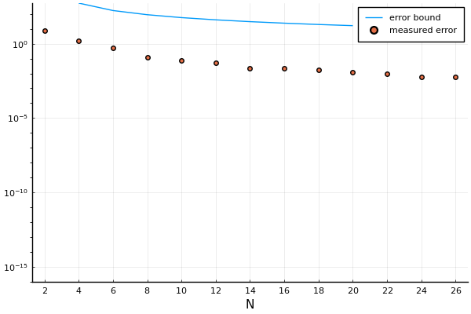
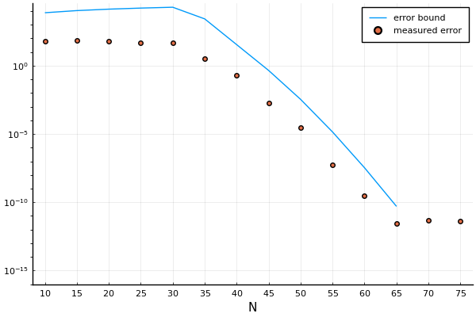

# Approximating maps between linear spaces

Approximate functions of type
$$\reals^m \to \reals^n.$$

This package exists mostly so that I can use it in `ManiFactor.jl`.

TODO: Cite article for the error bounds.

## Example: Reciprocal of quadratic

Approximate
$$ g(x) = \frac{1}{1 + x_1^2 + x_2^2 + x_3^2 + x_4^2}.$$

$N$ is the number of sample points in each direction, so that the total number of sample points is $N^4$.

## Example: Dominant singular value

Approximate
$$\mathrm{dominant~singular value}(8 A_0 + x_1 A_1 + \dots + x_4 A_4),$$
where $A_0$, $\dots$, $A_4$ are randomly chosen $40 \times 60$ matrices such that $A_0$ is rank 1.

## Example: Gaussian

Approximate
$$\exp{(-x_1^2 - x_2^2 - x_3^2 - x_4^2)}.$$

## Example: Modified Gaussian

Approximate
$$\exp{(-\mathrm{sign}(x_1) x_1^2 - \mathrm{sign}(x_2) x_2^2 - \mathrm{sign}(x_4) x_3^2 - \mathrm{sign}(x_4) x_4^2)}.$$

## Example: Rastrigin function

Approximate the [Rastrigin function](https://en.wikipedia.org/wiki/Rastrigin_function) of 4 variables.

## Example: Griewank function

Approximate the [Griewank function](https://en.wikipedia.org/wiki/Griewank_function) of 4 variables.
Since the Griewank function oscillates a lot, we have to sample it very finely.
But sampling in that many points is too expensive.
So we import `approximate_scalar` explicitly and extend it with an approximate tensor decomposition from [teneva](https://github.com/AndreiChertkov/teneva).

